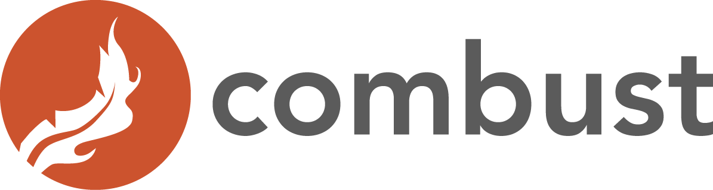
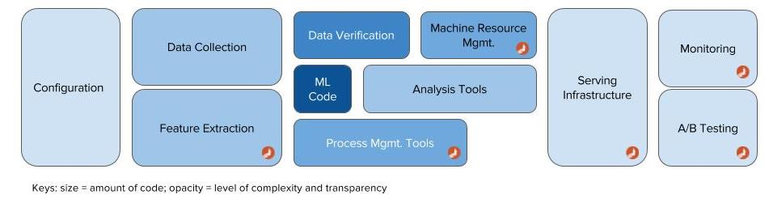

# Combust Cloud

Combust Cloud is a platform for deploying, serving, monitoring and managing your machine learning pipelines and algorithms.

`Hidden Technical Debt in Machine Learning Systems` is a paper published by Google engineers that make a claim that the hardest part of AI isn't AI but rather all of the supporting systems that have to be orchestrated to support all of the data pipelines and algorithms in a production environment. We share that belief and are providing open-source libraries like [MLeap](http://mleap-docs.combust.ml/) and the Combust Cloud to get teams and companies that utilize machine learning to production quicker.




Our platform allows for deploying machine learning pipelines and models to:
* RESTful API Servers on any platform
* IoT devices

## Our Philosophy

There are a number of companies and platforms in the machine learning space that provide tools to Data Scientists and Machine Learning Engineers to train and publish models as services. However, majority of these products require you to migrate to their technology stack, use their tools/ui and be bound to the algorithms they support. At the speed that ML and AI frameworks are evolving, if you're binding yourself to a proprietary system, you'll always be behind.

At Combust we are built on open-source technologies and our goal is to support popular ML frameworks like Spark, Scikit-Learn, TensorFlow and XgBoost. When you train and serialize a model to an MLeap Bundle, that asset is yours. When you deploy your model using `.deploy()` to a Combust Cloud instance, the core execution engine is MLeap Runtime, which is also open-sourced and is there for you to deploy on your hardware.

## Our Products

### MLeap

MLeap is an open-source serialization format and execution engine for machine learning pipelines. It supports Spark, Scikit-learn and Tensorflow for training pipelines and exporting them to an MLeap Bundle. Serialized pipelines (bundles) can be deserialized back into Spark, Scikit-learn, TensorFlow graphs, or an MLeap pipeline for use in a scoring engine (API Servers).


### Combust Public Cloud

Combust Public Cloud is a simple hosting solution for your ML Pipelines and models. We offer hosting for a limited number of bundles per user in a shared, but secure, environment. Deploying your ML pipeline to the Public Cloud is easy:

1. Sign-up on combust.com and get a user-name and a secure passcode 
2. Fit your ML Pipeline and Model in Scikit-Learn or Spark (TensorFlow coming soon)
3. With a few lines of `.deploy()` code, your model is now a scoring service


```scala
// Deploy Spark's ML Pipeline to production (sparkPipelineLinearRegression)
{
    Await.result(sparkPipelineLinearRegression.deploy("http://models.combust.ml:65327", 
                                                      "my_username", 
                                                      "my_model_lr", secure_token), 10.seconds)
}
```

Read more about the Combust Public Cloud here.

### Combust Private Cloud

Combust Private Cloud is a personalized, containerized environment for you to deploy your ML Pipelines to. Just like the Public Cloud, we take care of the hard stuff, like:
* Managing cluster size and number of nodes needed to power your app. Our cluster solution is build on Akka and is highly scalable and performant
    * Load balancing is included
* Monitoring - get access to additional tools to monitor your application
* Deploy unlimited number of ML Pipelines
* 24x7 Support - our team will help you integrate with MLeap and Combust and support your application's needs

Remember, there is no product lock-in. Your pipelines and models are available as MLeap Bundles, and serving infrsastructure is provided via dockerized containers running the open-source MLeap Runtime environment.

To get started, email us at combust@combust.ml

### Combust IoT

Combust IoT is a product we're incubating internally. We've had early success with commercial clients, deploying deep learning models to embeded devices as well as drones. 

Have an interesting project? Let's talk, email us at combust@combust.ml
